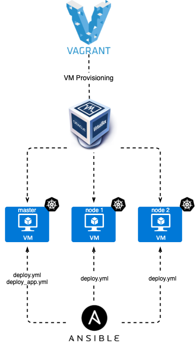
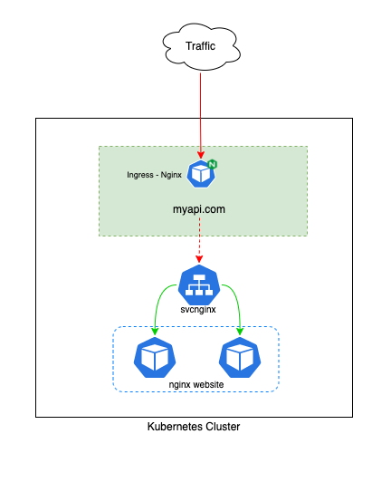
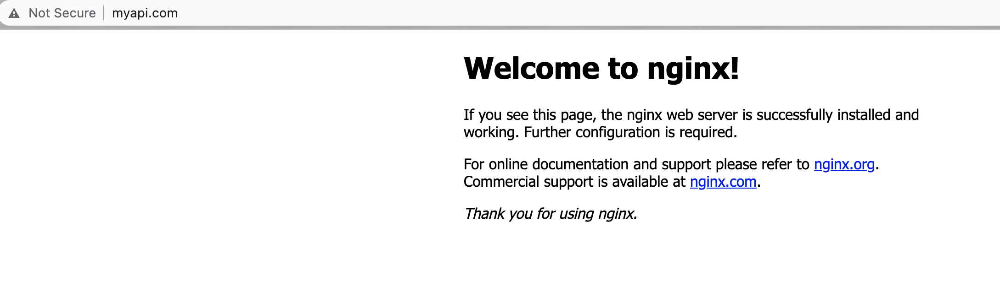

# Setup Nginx Ingress controller on K8s - Vagrant Environment.

> :warning: **This was designed only to be used on a Dev environment for education propose**: Be very careful here! You can read the official <a href="https://kubernetes.github.io/ingress-nginx/deploy/">documentation</a> for more information.

## Index

- [Requirements](#requirements)
- [Architecture](#Architecture)
- [Deploy](#deploy)
  - [Optional - Access Vagrant Virtual Machine](#optional-access-vagrant-virtual-machine)
  - [Result](#result)
  - [Delete the env](#delete-the-env)

## Requirements

These tools need to be installed on your local machine or the computer that will run Ansible:

- <a href="https://www.vagrantup.com/downloads">Vagrant</a>
- <a href="https://www.virtualbox.org/wiki/Mac%20OS%20X%20build%20instructions">VirtualBox</a>
- <a href="https://docs.ansible.com/ansible/latest/installation_guide/intro_installation.html#installing-ansible-on-macos">Ansible</a>

> :hammer: As part of this deployment, we need to change our local host file (/etc/hosts). My host files on my MacBook is located at /etc/hosts.

Add the below entry to the file.

```bash
10.10.50.11 myapi.com
```

## Architecture

This automation will deploy 2 Kubernetes nodes and 1 Kubernetes master as shown below.



Ingress exposes HTTP and HTTPS routes from outside the cluster to services within the cluster. Traffic routing is controlled by rules defined on the Ingress resource.

I'll deploy the Nginx Ingress to control all traffic from **myapi.com/** to go to **svcnginx** Kubernetes services.



# Deploy

Execute at the root directory:

```bash
sudo vagrant up --no-provision && sudo vagrant provision
```

## Optional: Access Vagrant Virtual Machine

You can access the master VM executing the below command on the current folder

```
vagrant ssh k8s-master
```

This command will `ssh` to k8s-master VM.

## Result

Once the ansible deployment finishes, you can access `http://myapi.com`.



## Delete the env

```bash
sudo vagrant destroy -f
```
